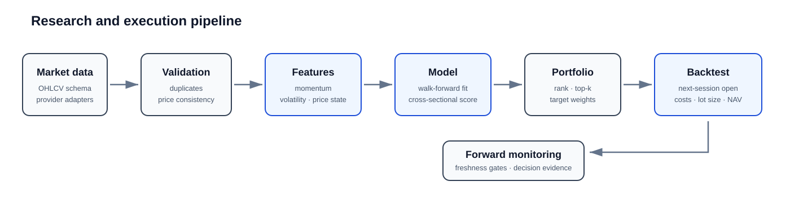
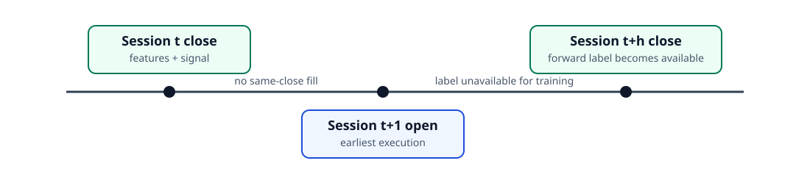

# Vietnam Equity Quant Lab

[](https://github.com/Tienkhoaa2908/VietNam-equity-quant-lab/actions/workflows/ci.yml)
[](https://github.com/Tienkhoaa2908/VietNam-equity-quant-lab/actions/workflows/reproducibility.yml)
[](https://www.python.org/)
[](LICENSE)

A reproducible quantitative-equity research framework focused on causal model training, cross-sectional ranking, execution-aware backtesting, data-quality controls, and realtime readiness checks.

This public repository presents the technical core of a larger private Vietnamese-equity research system. It intentionally excludes broker credentials, account data, proprietary datasets, production state, and order-submission code.



## What the repository demonstrates

- validated OHLCV ingestion from local files or HTTP CSV sources;
- deterministic data fingerprints and source manifests;
- backward-looking momentum, volatility, price-position, and liquidity features;
- cross-sectional winsorization and normalization;
- forward-return labels with explicit availability dates;
- expanding, chronological model training with no random train/test split;
- cross-sectional Ridge regression and rank-information-coefficient diagnostics;
- top-k equal-weight portfolio construction;
- next-session-open execution, round-lot sizing, transaction costs, residual cash, and continuous NAV;
- deterministic research reports with equity, drawdown, rank-IC, and coefficient charts;
- fail-closed realtime checks that keep trade, order-book, and broker freshness separate;
- automated tests for causality, accounting, schema validity, reproducibility, and stale-data handling.

## Research timing contract

A signal formed from session `t` may use information available by the close of `t`. It executes no earlier than the open of the next market session. A forward label is eligible for training only after the entire label horizon has been observed.



These constraints are implemented in code and covered by tests. They are not documentation-only conventions.

## Repository layout

```text
.
├── configs/                         # reproducible research settings
├── data/sample/                     # small public-safe schema example
├── docs/                            # architecture, methodology, model and data contracts
├── examples/                        # minimal executable examples
├── artifacts/example_report/        # deterministic report generated from synthetic data
├── scripts/                         # data and report utilities
├── src/vn_equity_quant/
│   ├── data/                        # source adapters, validation, lineage
│   ├── features/                    # time-series and cross-sectional features
│   ├── models/                      # labels, Ridge model, chronological fitting
│   ├── portfolio/                   # ranking and target weights
│   ├── backtest/                    # next-open simulator and metrics
│   ├── realtime/                    # freshness and readiness gates
│   ├── reporting/                   # charts and research report generation
│   └── research/                    # end-to-end orchestration
└── tests/                           # causal, accounting and integration tests
```

## Quick start

```bash
python -m venv .venv
source .venv/bin/activate        # Windows: .venv\Scripts\activate
python -m pip install -e ".[dev,report]"
pytest
```

Run the deterministic demonstration:

```bash
vnq demo --config configs/research_demo.toml
```

Generate a complete report:

```bash
vnq report --config configs/research_demo.toml --output artifacts/local_report
```

Validate a CSV dataset against the project data contract:

```bash
vnq validate --csv data/sample/mini_ohlcv.csv
```

Evaluate a realtime readiness snapshot:

```bash
python examples/realtime_gate_demo.py
```

## Example research output

The committed example report is produced from deterministic synthetic data. It exists to demonstrate the research and reporting pipeline, not to claim investment performance.

| Output | Location |
| --- | --- |
| Research report | [`artifacts/example_report/research_report.md`](artifacts/example_report/research_report.md) |
| Metrics | [`artifacts/example_report/metrics.json`](artifacts/example_report/metrics.json) |
| Equity curve | [`artifacts/example_report/equity_curve.svg`](artifacts/example_report/equity_curve.svg) |
| Drawdown | [`artifacts/example_report/drawdown.svg`](artifacts/example_report/drawdown.svg) |
| Rank IC | [`artifacts/example_report/rank_ic.svg`](artifacts/example_report/rank_ic.svg) |
| Model coefficients | [`artifacts/example_report/model_coefficients.svg`](artifacts/example_report/model_coefficients.svg) |

## Data policy

The framework does not redistribute commercial Vietnamese market data. Public code accepts a documented OHLCV schema and can be connected to a lawful data source through the source adapters. The repository includes a small synthetic sample for schema validation and deterministic generated data for full demonstrations.

See [Data contract](docs/data_contract.md) and [Data sources](docs/data_sources.md).

## Documentation

- [Architecture](docs/architecture.md)
- [Research methodology](docs/methodology.md)
- [Data contract](docs/data_contract.md)
- [Data-source integration](docs/data_sources.md)
- [Model card](docs/model_card.md)
- [Backtest contract](docs/backtest_contract.md)
- [Realtime readiness](docs/realtime.md)
- [Reproducibility](docs/reproducibility.md)
- [Limitations](docs/limitations.md)

## Scope

This repository is research software. It does not place, cancel, or replace broker orders. Realtime components return readiness states and execution references only. Historical results generated by the demonstration use synthetic data and must not be interpreted as expected market returns.

## License

MIT. See [LICENSE](LICENSE).
