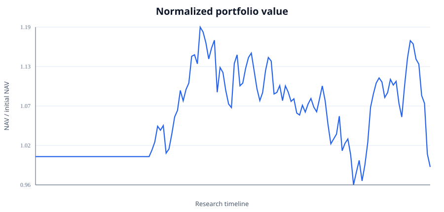
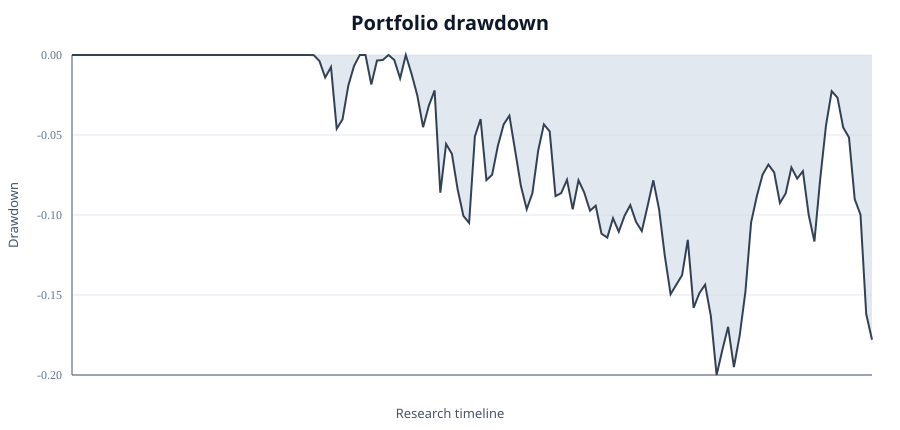
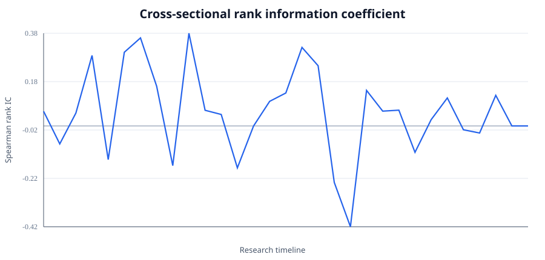
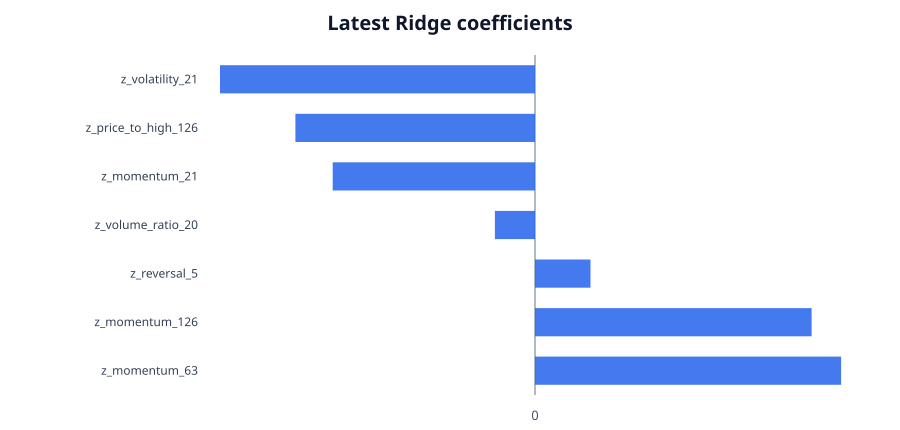

# Example Research Report

## Scope

This report is generated from deterministic synthetic OHLCV data. It validates the software pipeline and research timing contract. It is not evidence of expected returns in the Vietnamese equity market.

## Research configuration

| Parameter | Value |
| --- | ---: |
| Symbols | 30 |
| Sessions | 900 |
| Forward-return horizon | 20 sessions |
| Portfolio size | 10 names |
| Minimum training history | 252 sessions |
| Ridge alpha | 10 |
| Initial cash | 1,000,000,000 |
| Transaction cost | 10.0 bps per traded notional |
| Round lot | 100 shares |

## Results

| Metric | Value |
| --- | ---: |
| Total return | -1.52% |
| CAGR | -0.43% |
| Maximum drawdown | -20.00% |
| Annualized volatility | 11.07% |
| Sharpe, zero rate | 0.02 |
| Mean rank IC | 0.060 |
| Signals | 31 |
| Trades | 437 |
| Transaction cost | 39,154,185 |
| Gross annualized turnover | 10.34x |

## Diagnostics

## Timing and leakage controls

- Features at date `t` use data at or before `t`.
- A forward label enters training only when `label_available_date <= signal_date`.
- Portfolio targets formed on a signal date execute at the next available session open.
- Transaction costs and round-lot constraints are applied during execution.
- Missing prices for a target or held position stop the simulation rather than being skipped.

## Data lineage

The generated dataset contains 27,000 rows across 30 symbols from 2020-01-02 to 2023-06-14. Its deterministic fingerprint is `21e847d6050650d130486cc1f9b648e03e56d623aedcd382682db89cfc65b2ed`.

## Interpretation

The synthetic generator intentionally contains persistent cross-sectional structure so that the complete research stack can be tested. Performance values therefore describe this deterministic software fixture only. They must not be presented as historical Vietnamese-market performance.
